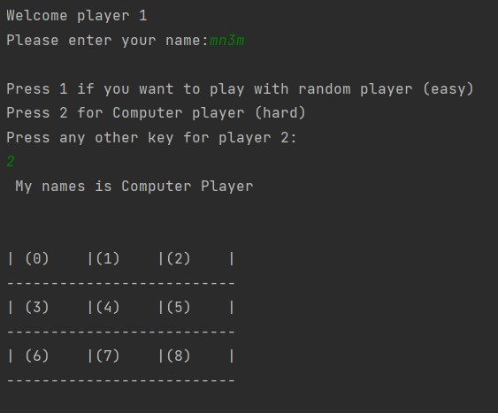
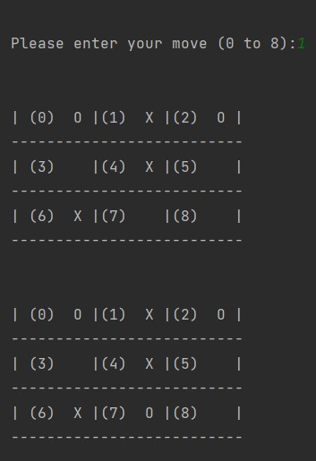
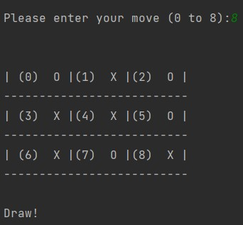

# TicTacToe_Game

## Tic Tac Toe game using classes and AI (minimax algorithm)







```
// Class definition for XO game classes
// Author:  Mohammad El-Ramly
// Date:    10/10/2022
// Version: 1

// Contributor: AbdelMonem Tarek
// Date: 7/11/2022

#ifndef _XO_CLASSES_H
#define _XO_CLASSES_H

#include <string>
using namespace std;

// This class represents a 3 x 3 board_ptr
// used in X_O game

class Board {
protected:
   char board[3][3] = {{0}};
   int  n_moves = 0;

public:
   // Return true  if move is valid and put it on board_ptr
   // within board_ptr boundaries in empty cell
   // Return false otherwise
   bool update_board (int x, int y, char symbol);
   // Returns true if there is any winner
   // either X or O
   // Written in a complex way. DO NOT DO LIKE THIS.
   bool is_winner();
   // Return true if 9 moves are done and no winner
   bool is_draw();
   // Display the board_ptr and the pieces on it
   void display_board();
   // Return true if curr_board[x][y] is empty
   bool is_empty_pos(int x, int y);
   // undo move used in AI player
   void undo_move(int x, int y);
   // return n of moves done
   int get_n_moves() const;
};

///////////////////////////////////////////
// This class represents a player who has
// a name and a symbol to put on board_ptr
class Player {
    protected:
        string name;
        char symbol;
    public:
        // Two constructors to initiate player
        // Give player a symbol to use in playing
        // It can be X or O or others
        // Optionally, you can give him ID or order
        // Like Player 1 and Player 2
        Player (char symbol); // Needed for computer players
        Player (int order, char symbol);
        // Get desired move: x y (each between 0 and 2)
        // Virtual (can change for other player types)
        virtual void get_move(int& x, int& y);
        // Give player info as a string
        string to_string();
        // Get symbol used by player
        char get_symbol();
};

///////////////////////////////////////////
// This class represents a random computer player
// that generates random positions x y (0 to 2)
// If invalid, game manager asks to regenerate
class RandomPlayer: public Player {
    public:
        // Take a symbol and pass it to parent
        RandomPlayer (char symbol);
        // Generate a random move
        void get_move(int& x, int& y);
};

///////////////////////////////////////////

class GameManager {
    public:
        void run();
        // This method creates board_ptr and players
        // It displays board_ptr
        // While True
        //   For each player
        //      It takes a valid move as x, y pair (between 0 - 2)
        //      It updates board_ptr and displays otit
        //      If winner, declare so and end
        //      If draw, declare so and end

};


/////////////////////////////////////////////////
// This class represents AI computer player
class ComputerPlayer: public Player {
    // ptr to board to get access to it
    Board * curr_board;
    // minimax algo to return best score for a single move
    int minimax(int depth, bool isMaximizing);
    // make x and y equal to position of the highest score of all empty cells
    void get_best_move(int& x, int& y);

public:
    ComputerPlayer(char symbol, Board& board);
    void get_move(int& x, int& y);

};
```
